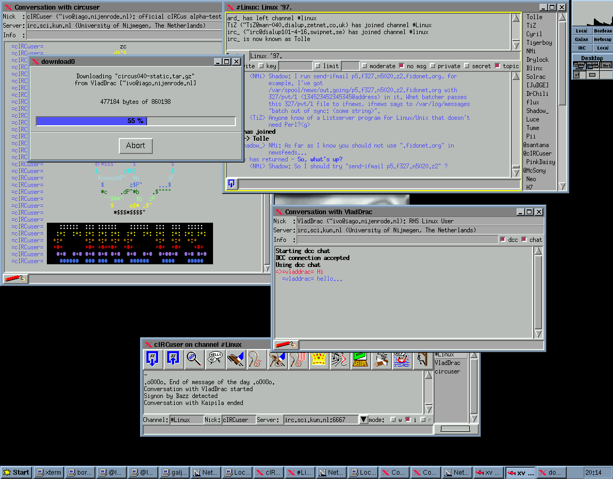

# cIRCus (irc client)

cIRCus is an IRC client I wrote somewhere around 1997/1998. It started out as a
university C++ assignment project. One of the requirements was that it used
"hush", a C++ wrapped around tcl/tk/wish.

I later rewrote hush entirely and called it plush. It's part of the source.

This is old code. C++/STL was quite different back then. Don't judge me by what
you find here :)

Oh. This is what it looked liked:

